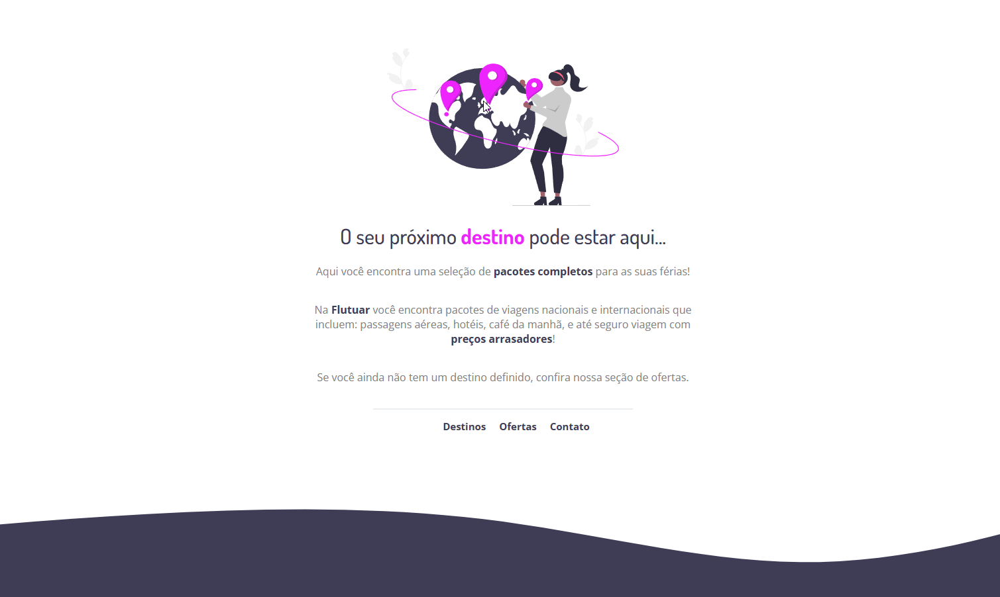

<h1 align="center"> Flutuar </h1>

O seu próximo destino pode estar aqui...   Recriando uma aplicação a partir de um layout pronto no Figma.

 

  

## Sobre o desafio

Recriar uma aplicação a partir de um layout pronto no Figma.

- Estruturando um projeto HTML;
- Uso de tags HTML mais comuns;
- Conceitos iniciais de CSS;
- Posicionamento e alinhamento de elementos na tela;
- Aplicando fontes customizadas;
- Espaçamentos.

## 🚀 Tecnologias

Esse projeto foi desenvolvido com as seguintes tecnologias:

- HTML e CSS
- JavaScript
- Git e Github
- Figma

## 💻 Projeto

- [Acesse o projeto finalizado](https://github.com/flfelipelima/rocketseatDesafio-extra)

- [Rocketseat](https://rocketseat.com.br)

## 🔖 Layout

Você pode visualizar o layout do projeto através [DESSE LINK](). É necessário ter conta no [Figma](https://www.figma.com/file/waisYRoNzeBgIxOyrz0b2R/Projeto01-Extra/duplicate) para acessá-lo.
